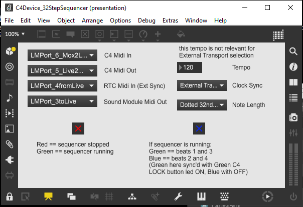

This Max 8.6.2 project implements a midi data server (in javascript) and leverages the server to implement a 32 step 
midi sequencer.

When first opening the project patch, you'll need to select 3 or 4 midi ports on your system to connect the patch to 
your C4, a midi sound module, and possibly an external clock via midi RTC.  You can make those selections in the "umenu" 
ui objects every time you load the patch, or you can open the underlying project "bpatcher" to save your selections 
so they reload again every time you reload the patch.  

To save your Midi Port selections, open the project <a href="./C4DeviceProject/patchers/setupProjectMidiPorts.maxpat">
"setup midi" bpatcher</a> for editing and select from the "C4" dropdown menus the 
midi input and output ports that connect to your C4 on your system. Then replace the 14, for example, arg in the "loadmess" 
Max object with the number of the index(es) you selected (counting from 0).  Next time the project patch loads, if you 
saved changes, the "setup midi" bpatcher will remember the last midi ports you selected and connect to them again 
(because it "loadbanged" your last ui selections, your saved "loadmess" index is kind of only cosmetic like my 14).  
Similarly, connect the "sound module" midi output port to the port on your system connected to whatever device will musically 
respond to the sequencer's output messages.  Finally, if you wish, connect the "sync" midi input port to a port on your 
system that can send "midi RTC" (start, stop, tick) signals (replace those "loadmess" indexes too and save your changes)
Sending RTC signals from Ableton Live is as easy as checking the Sync checkbox on the associated Midi Output port in Options.

The "midi data server" (javascript) part of this patch is meant to be reusable in other projects and or patches. (Turning 
the C4 hardware into a synth patch ui or a GLSL-jitter patch ui, for example)
The sequencer part of the patch is based on the "Livid Code" tutorial example under the "Interfacing Max with 
Hardware" section of 
<a href="https://cycling74.com/articles/working-with-hardware-livid-instruments%E2%80%99-code">the Cycling74 
documentation and support website</a>. Like the example, this patch implements a very simple 
32-step sequencer that runs at 120 bpm (by default, when Max Transport is selected) and produces 16th note steps at C 
minor pentatonic pitch intervals between C1 and C3 where (virtually) the sequencer-patch's entire user interface exists  
only on the "midi controller" hardware itself. 

Unlike the "Livid Code" original, this patch handles processing for 128 virtual encoders (across four "32 encoder" 
display pages), and every encoder can store and recall seven unique values (EncoderBtnReleased, EncoderBtnPressed, 
ShiftBtnPressed, OptBtnPressed, CtrlBtnPressed, AltBtnPressed, and LastIncrement).  This sequencer patch can also follow 
external midi RTC signals in addition to Max internal clocking.  The sequencer can generate "pure" (full length) 16th 
notes or dotted 32nd notes (0.75 length 16ths).

<h3> Sequencer Operations</h3>

<b>NOTE:</b> The Control Button labels screenprinted on the C4 case are a little different from the "Commander 
overlay" labels in the image above-top.  The image (of the C4 device front panel layout) above shows a screenshot of the 
left side of the "C4 Commander" app window (in Edit mode, and the only view of the app in Performance mode).  Specifically, 
the buttons labeled (on the Commander overlay sticker) "Parameter Layout" (Left, Right) in the image above are labeled 
"Parameter Bank" (Left, Right) on the C4 case itself; and the buttons labeled "(Session) Bank" (Up, Down) above are labeled 
"(Session) Slot" (Up, Down) on the case.  Since the area around the four buttons grouped around the diamond shape on the 
right in the image above is not grouped by name above nor physically on the C4 case, a useful shorthand name is the "Session" 
group. (The shape "inside the buttons" painted on the case is bigger and rounder much more oval-shaped (ovular?), no sharp 
diamond-pointy corners.) The "Select" button in the "Split" group (on the "Commander overlay") above is labeled the "Split" 
button in the "Function" group on the case.  The "Function" group above is named the "Assignment" group on the case.  All 
the sequencer operational descriptions below are based on the labels painted on the C4 case itself, not on any overlay 
labels (shown above or otherwise).

Activate sequencer steps by pressing encoder buttons, turning leds ON, deactivate steps by turning encoder button leds OFF; 
and adjust active step (playback) pitches by turning active encoders left or right.  The sequencer only outputs about 
15 unique pitches (pentatonic scale, three octaves) and the encoders store 128 possible values, so you will experience 
roughly 10 nothing-happened "encoder clicks" between audible playback pitch changes.

<h5> Function group Buttons</h5>

Change the current "encoder display page" using the C4's "Split" button ("Select" above).  Page 0 is the "main page" whose display 
alternates with display of the other three pages in the biased cycle 0, 1, 0, 2, 0, 3. The Split button LEDs are 
associated with the 3 "other pages" 1/3, 2/3, 3/3. The main page displays when all Split LEDs are OFF.

The Lock button ("Upper" above) reverses the direction of the Split button LED cycle.  When the Lock LED is ON, the Split 
LED cycles in reverse 3, 2, 1.  When the Lock LED is OFF, the Split LED cycles forward, 1, 2, 3.  The described cycle
reversing logic is always true based on the underlying data in the button dictionary, but the physical Lock LED status depends on
whether the sequencer is running or not.  If the sequencer is not running, the physical Lock button LED On/Off status will 
correspond with the (Lock button's ledValue property) data in the button dictionary.  But if the sequencer is running, 
the green Lock button LED pulses with the sequencer tempo.

When Max Transport is selected, Start and Stop the sequencer using the C4's "Spot Erase" button ("Lower" above).  Otherwise, 
Start and Stop the sequencer using external Transport controls.

When the sequencer is running under Max Transport, the "Spot Erase" button LED will be ON (red), and the "Lock" button
LED will display (green) quarter (half?) note pulses (beats 1 and 3 ON, beats 2 and 4 OFF)

When the sequencer is running under external Transport, the C4's "Spot Erase" button LED status (virtual or physical) has 
no impact on the sequencer's running status (which follows midi RTC start/stop signals), it's disconnected, and the green 
"Lock" button LED pulses with the external (RTC derived) tempo. (regardless whether "Spot Erase" is On or Off)

<h5> "Session" group Buttons</h5>

You can "rotate" each 32-step "encoder page" sequence around its display page.  The "Slot Up" button will rotate the 
sequence up one encoder row, wrapping around to the bottom row. The "Slot Down" button will rotate the other way, 
wrapping around to the top.  "Track Left" and "Track Right" work the same way but only rotating by one encoder at a 
time instead of eight.  For example, pressing "Track Left" eight times in a row is equivalent to a single "Slot Up" press.

You can effectively "stutter" the two beats of any sequence represented by any row of 8 encoders by repeatedly pressing
the "Slot Down" button (in time) as the sequence plays.

It's not difficult to randomly create sequences that "feel" like the One of the sequence is off from the One of the 
Transport metronome.  The Ones of each bar of sixteenth-note-steps in this 32-step sequencer are represented by encoder 00 and 
encoder 16.  Say the "feel" of some random sequence puts the One of the sequence at encoder 12 instead. If that's a problem, 
you could fix it, for example, by pressing "Track Right" four times to rotate the sequence's One from encoder 12 to encoder 
16 to align with the Transport metronome's One (in bar two of sequence).  Of course, you can always "rotate" any sequences 
for any reason.

<h5> Parameter group Buttons</h5>

You can also "rotate" each "encoder page" sequence around the whole book of display pages using the Parameter "Bank" 
buttons.  Page 0 becomes page 1 or 3, for example.  Or you can "Single Left" to rotate row 0 on page 0 data to 
row 3 on page 3.  (Slot Up/Down buttons respect page boundaries, Single Left/Right buttons only respect the Book boundary)

You can effectively create longer sequences by "banking Left/Right" (in time) so each sequence-page "displays and plays" 
in turn.  

The audible result of "Bank Left" and "Bank Right" button presses can be indistinguishable from "Split" button
presses.  The difference is kind of subtle.  The "Split" button changes the "feedback display page" shown on the C4 so 
the (32 encoder) "feedback viewport frame" over the underlying data moves from showing page 0 data to showing page 3 data, for 
example, but the data doesn't actually move, page 0 data remains associated with page 0 encoders, the viewport frame just
moves to page 3.  The "Bank" buttons on the other hand, cause (the underlying) data to get rearranged, page 0 data 
"rotates" to become associated with page 1 or 3 encoders.  

Another difference between the behaviors associated with these buttons is the page rotation cycle length.  The "Split" 
button cycles pages in "main page biased" order 0,1,0,2,0,3. (depending on "Lock" button direction selected), while the 
"Bank" buttons cycle pages-of-data evenly 0,1,2,3.  The "Split" button only changes the display-page view not any data, 
and the Parameter and Session buttons change (rotate) data not the display-page view.

You can rotate the data associated with any sequence to be on the "main page" so that sequence enjoys the "Split button 
cycle bias".

<h5> Modifier group Buttons</h5>

Every "virtual" encoder stores and recalls a unique value associated with each Modifier button when the modifier is 
pressed.  In effect, this means each of the four main "encoder display page" sequences also has four "modified sequences" 
readily available. In other words every 32-step "encoder display page" sequence also has a "Shift Pressed" modified 
version, and an "Option Pressed" modified version, etc...  These modified sequences remain unchanged stepwise.  
The only thing that changes when Modifier buttons are pressed (and held) is the pitch value data recalled from storage 
for a sequence's active, playing steps.

<h5> Assignment group Buttons</h5>

The four "Assignment" buttons (Marker, Track, Chan Strip, and Function) are not mapped to any sequencer behavior.  Midi 
data produced by these buttons is stored by the server and fed back to the C4, but has no impact on the sequencer.
(The "Assignment" LEDs turn on and off, but serve no purpose)

<h5>Links</h5>

<ul>-<a href="https://loudaudio.netx.net/api/file/asset/9331?sessionKey=KlNY16QMrM8t1URx7xTEziHfI">
https://mackie.com/en/support/discontinued-products</a>/Software/Control Surfaces/C4Pro/c4c_pc_v1.0.zip (and instruments.zip)

-<a href="https://loudaudio.netx.net/api/file/asset/18461?sessionKey=KlNY16QMrM8t1URx7xTEziHfI">
https://mackie.com/en/support/discontinued-products</a>/Manuals/Control Surfaces/C4/Mackie Control C4_OM.pdf 
(also /Manuals/Control Surfaces/C4Commander/Programmer's Guide.pdf and User's Guide.pdf)
</ul>

The Commander Programmer's Guide is about the xml syntax of the "instrument definition files" found in the 
instruments.zip download archive (how to write custom instrument definition files for other instruments, basically).  
The Commander User's guide is about how to create "Performance layout" files using the Commander app (in Edit mode) where 
the "user layout" files define both "page views" that will be shown on the C4 (while Commander is connected and running in 
"Performance" mode) and exactly how the C4 will communicate via Commander translations with the defined "instrument 
parameter" mapped to each C4 control).  No instruments that entered the market after about 2005 are represented 
in the instruments.zip download archive.

Maybe someday some future version of "this" Max patch will be able to read, write, and react to those "Commander" 
definition and layout files ("replacing" the Commander app's versatile "performance" functionality in modern Max)

Otherwise, the biggest patch TODO is implementing the saving and recalling of patch (sequencer data) presets.

