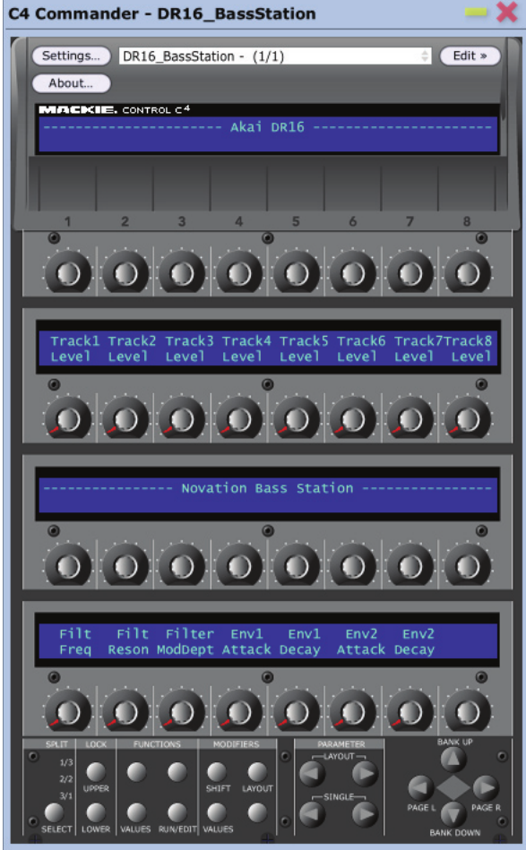

<h3>Version 2.0</h3> 

of this Max 9.0.5 project integrates with the Mackie C4 remote script hosted by 
<a href="https://github.com/markusschloesser/MackieC4_P3"> Markus Schloesser</a> as the script's USER mode.

The integration is still in development, not necessarily ready for full release.  But it is stable enough to
push to origin here.  (If running on the same computer as a DAW like Live), the integration requires one more midi loopback port 
(on top of the two required for standalone sequencer operation) 
between Live's "C4 remote script" midi out and this patch's "C4 Midi In" port.  Connections should flow like this

    C4o--->>---iLiveo--->L1>---iMaxo--->>---iC4     // Remote script and Sequencer patch Control comms ports
    Liveo--->L2>---iMax                             // Midi RTC (real time clock) (Max) input port
    Maxo--->L3>---iLive                             // Sequencer Midi Note (Max) output port

You should be able to use this patch with the remote script as long as you hold a Max4Live license, meaning you have a 
Live Standard + M4L or Live Suite license active. The 2.0 update here (and associated remote script updates) were entirely coded in 2025 using Max 8.x.x - 9.0.5 and Live 12.1.x - 12.1.10.  
The remote script should be backward compatible with both Live 10 and 11 and the sequencer patch is compatible with Max 8, but these combinations haven't been tested.  
Except Live 12.1.5 still runs "Max 8" as the default M4L engine, and this is the setup used for M4L-license-only testing.

<h5>Getting started</h5>

In the "MackieC4_P3" repository, switch to the "Live12UserMode" branch (if it hasn't been merged with "main" yet) and download the ./wip/MackieC4 
folder and its contents.  Paste the folder and contents into your "MIDI Remote Scripts" folder.  On Windows by default that path looks like this 
C:\ProgramData\Ableton\Live 12 Suite\Resources\MIDI Remote Scripts.  Then start Live and add the (new) MackieC4 "remote script" to 
an open script slot (Live Options midi tab) including selecting both C4 midi DIN ports.  If the remote script doesn't start working 
(processing button clicks and showing feedback, for example) as soon as you close Options, restart Live.  If it still doesn't work, check all your
port assignments and or Markus's<a href="https://github.com/markusschloesser/MackieC4_P3/wiki"> wiki</a>.  Test going into and coming out of USER mode.  
If you don't see USER mode text on the LCDs telling you how to exit USER mode, (press+hold) Marker + (press) LOCK, then you don't have the correct (latest?) remote 
script version installed into Live.

Once you've confirmed the (Sequencer compatible) remote script is working, remove the "remote script midi output" port assignment (leave the script input port assignment) 
and replace the output assignment with a connection to this patch, on the same computer that's a midi Loopback port (L1 above).  Further down the Options Midi tab uncheck (disconnect from) the Live Midi Output
that goes to the physical C4 DIN input port (disconnect Live from the same port you just disconnected from the remote script), and check (connect to) the other two 
loopback ports. L1 and L2 are "Live Midi Output" ports and L3 is a "Live Midi Input" port.  You should have 4 associated midi ports open in Live, the 3 loopback ports 
and the input port coming from the physical C4 DIN. (plus any other midi ports you want)  Now close and restart Live.  When Live is ready again, 
the remote script will only be connected on the front side (C4 to Live).  You can move Live's selected track Left and Right using the C4 Track L and Track R 
buttons, for example, but you won't see any LEDs or LCDs reacting to "midi feedback" because the feedback-side isn't connected yet. Now, click
the TRACK button in the Assignment group on the C4 "control panel" to put the script in "Device(s on selected Track)" mode.  Both FUNCTION and CHAN
STRIP button modes "spam" CC feedback messages to the C4 that could interfere with starting the sequencer patch.  TRACK button (device) mode is quiet by default after the 
"mode change" updates.  Now the remote script is ready and waiting for the Sequencer.  

Open Max.  Drag a default m4l device onto a Track in your session and click the <=> icon upper right corner of the device window to open the m4l device Patcher.
In a Max window like the Patcher that just opened click File>Open... navigate to your local "production" copy of this project's C4DeviceProject folder in the Open-File dialog
(main branch of the repository) and...

<h5><b>Open the project file C4DeviceProject.maxproj</b></h5>

It is important to open the project file first and open other project files from the project menu because the project establishes a Max-project-relative search path for 
all the other files in their project-relative folders like /code, /data, /patchers, etc. 
("path finding" in Max is otherwise a PITA, patches have no idea what folder they started in, Max doesn't interpret a simple relative path like, "../code/foo.js" 
(up one level from where this patch file is located and down into /code, look for a file named foo.js)) the way you would normally expect. A '.' is generally 
interpreted as the folder where max.exe is located.  Inside a project, the "search path" starts in the project folder and recurses.  You just write "foo.js" and the file is found.

From the "Project menu" window, open the patch file named `openSequencerBypassing.maxpat`.  
After the Sequencer patch loads, ensure the patch's 4 midi port connections are set for your local system.

    "C4 Midi In" port should connect to the L1 loopback (coming from Live remote script midi out)
    "C4 Midi Out" port should connect to the C4 DIN input port (going to the physical C4 unit)
    "RTC Midi In" port should connect to the L2 loopback (coming from a Live Midi Out port with "Sync" checked)
    "Sound Module Midi Out" port should connect to the L3 loopback (going to a Live Midi In port with "Track" checked)

Since the Sequencer patch opened in "bypassing" mode, and the remote script is still in DEVICES mode (Track button), you should start to see all the
normal remote script feedback appear on the C4 "display" (the LEDs and LCDs) in response to button presses and encoder turns on the C4 and other actions 
in Live that trigger feedback (like a mouse click changing the selected track).  

If you don't see "feedback display updates" on the C4 display (the LEDs and LCDs), double-check your midi port connections.  Also try running the sequencer patch in standalone mode.  
Disconnect the remote script in Live and connect both Sequencer "C4 Midi" (in and out) ports to the C4 DIN ports. Close the "start in bypassing mode" patch and 
open the "start in processing mode" patch.  This standalone configuration should work (without the remote script involved).  If both the remote script and the sequencer work independently 
but not when chained, double-check that L1 loopback connection.  Otherwise, start or append to an "Issues" thread here.

Now with the remote script showing feedback successfully (through this sequencer's bypass), click the physical C4 MARKER button to initiate two changes. To switch the script 
from DEVICES mode (Track button) to USER mode (Marker button), and to switch the Sequencer patch to PROCESSING mode (via a midi message signal to javascript).
(Alternatively, if the remote script was already in USER mode (because you pressed the MARKER button first), you would just
open the Project>patch file named `openSequencerProcessing.maxpat`)  The C4 "display" might be blank at first after USER mode starts, but press the SPLIT button and you should see 
"page 1" (of the "bridge deck" data) display on the C4.  Click SPLIT again and the "Page 0" data is displayed (properly this time).

To Exit USER mode, Press and Hold the MARKER button then Press the LOCK button.  The remote script goes back to whatever other mode was active before going into USER mode and 
the sequencer patch goes back into "bypassing" mode.  Keep reading (below) for sequencer operation details, and Markus's wiki for remote script operation details.  Enjoy. Have fun.

It is best practice to exit USER mode before you load or reload another session in Live because the "new set" won't open with the remote script in USER mode
and the sequencer patch will probably get out-of-sync with the remote script in that case.

A similarly important practice for your local system is calibrating the "midi sync delay" subtracted from the RTC Midi Out port in Live Midi Options (Options>Midi tab), for 
example, could be any RTC source/Note destination "daw".  You want to send out the RTC "early" so the Notes come back "on time".
Every different session could impart subtly different amounts of latency.  -2.5 to -5.0 milliseconds or more (negative) is typical.  You can also use this setting creatively, like a midi delay.

<h4>Updates since v1.0</h4>
<ul>
<li>You can now save and load sequencer dictionary JSON files. (from/to the project/data/c4Controllers folder by default)</li>
<li>The sequencer now has a VERBOSE mode that applies when the remote script is NOT in USER mode so the sequencer will keep sending Notes (but not updating the C4 display). For example, when 
the script is in USER mode, the Spot/Erase button acts like a vehicle's clutch. Meaning when the red Spot/Erase LED is ON you've "stepped on the clutch" and disengaged from the  
(external RTC) Transport so the sequencer stops running (next list item about Spot/Erase applies here too).  When the script is NOT in USER mode, the clutch is engaged by default 
(the sequencer is QUIET), but you can "let off the clutch" outside of USER mode by setting the sequencer to VERBOSE mode to re-engage with the RTC Transport and let the sequencer 
run (outputting Notes only, no "display updates")</li>
<li>When the sequencer is in "External Transport" mode, the "Spot/Erase" button controls whether the sequencer "follows" the RTC signals.  When the Spot/Erase LED is ON, 
the sequencer is "disengaged" from the "External Transport" so the sequencer doesn't run.  This Spot/Erase LED behavior is opposite to its behavior when in "Internal Transport" mode 
where LED ON means internal transport is driving the sequencer pulses. If you are in USER mode and using MAX Transport instead of RTC, and you leave USER mode with a VERBOSE 
sequencer sending Notes, you have to return to USER mode to STOP the Max Transport using the physical Spot/Erase button (QUIETing the sequencer Note output won't stop the Max Transport)</li>
<li>The Sequencer no longer does any pitch coercion (to C minor pentatonic), except to scale the Note values output between 12 and 120 (i.e. a normal piano's 10 octave range)</li>
<li>An encoder's stored "pressedValue" now supplements the sequencer's randomly generated (scaled between 50 and 120) velocity for that sequence step. (If the Pressed value is 78 or higher, 
every note output will have the maximum 128 velocity) If the sequencer is running, and
the encoder button "isPressed" when the "hot step" hits, the encoder's "pressedValue" is still used for that step's Note value too (v1 behavior)</li>
</ul>

<h3>Version 1.0</h3> 
of this Max 8.6.2 project implements a midi data server (in javascript) and leverages the server 
to implement a 32 step midi sequencer.

When first opening the project patch, you'll need to select 3 or 4 midi ports on your system to connect the patch to 
your C4, a midi sound module, and possibly an external clock via midi RTC.  You can make those selections in the "umenu" 
ui objects every time you load the patch, or you can open the underlying project "bpatcher" to save your selections 
so they reload again every time you reload the patch.  

To save your Midi Port selections, open the project <a href="./C4DeviceProject/patchers/setupProjectMidiPorts.maxpat">
"setup midi" bpatcher</a> for editing and select from the "C4" dropdown menus the 
midi input and output ports that connect to your C4 on your system. Then replace the 14, for example, arg in the "loadmess" 
Max object with the number of the index(es) you selected (counting from 0).  Next time the project patch loads, if you 
saved changes, the "setup midi" bpatcher will remember the last midi ports you selected and connect to them again 
(because it "loadbanged" your last ui selections, your saved "loadmess" index is kind of only cosmetic like my 14).  
Similarly, connect the "sound module" midi output port to the port on your system connected to whatever device will musically 
respond to the sequencer's output messages.  Finally, if you wish, connect the "sync" midi input port to a port on your 
system that can send "midi RTC" (start, stop, tick) signals (replace those "loadmess" indexes too and save your changes)
Sending RTC signals from Ableton Live is as easy as checking the Sync checkbox on the associated Midi Output port in Options.

The "midi data server" (javascript) part of this patch is meant to be reusable in other projects and or patches. (Turning 
the C4 hardware into a synth patch ui or a GLSL-jitter patch ui, for example)
The sequencer part of the patch is based on the "Livid Code" tutorial example under the "Interfacing Max with Hardware" section of 
<a href="https://cycling74.com/articles/working-with-hardware-livid-instruments%E2%80%99-code">the Cycling74 
documentation and support website</a>. Like the example, this patch implements a very simple 
32-step sequencer that runs at 120 bpm (by default, when Max Transport is selected) and produces 16th note steps at C 
minor pentatonic pitch intervals between C1 and C3 where (virtually) the sequencer-patch's entire user interface exists  
only on the "midi controller" hardware itself. 

Unlike the "Livid Code" original, this patch handles processing for 128 virtual encoders (across four "32 encoder" 
display pages over five "books" of pages), and every encoder can store+recall seven unique values (EncoderBtnReleased, 
EncoderBtnPressed, ShiftBtnPressed, OptBtnPressed, CtrlBtnPressed, AltBtnPressed, and LastIncrement).  This sequencer 
patch can also follow external midi RTC signals in addition to Max internal clocking.  The sequencer can generate full 
length 16th notes (kinda-legato) or 0.75 length 16th notes (dotted 32nd notes).

<h3> Sequencer Operations</h3>

<b>NOTE:</b> The Control Button labels screenprinted on the C4 case are a little different from the "Commander overlay" labels in the image above-top.  
The image (of the C4 device front panel layout) above shows a screenshot of the 
left side of the "C4 Commander" app window (in Edit mode, and the only view of the app in Performance mode).  Specifically, 
the buttons labeled (on the Commander overlay sticker) "Parameter Layout" (Left, Right) in the image above are labeled 
"Parameter Bank" (Left, Right) on the C4 case itself; and the buttons labeled "(Session) Bank" (Up, Down) above are labeled 
"(Session) Slot" (Up, Down) on the case.  Since the area around the four buttons grouped around the diamond shape on the 
right in the image above is not grouped by name above nor physically on the C4 case, a useful shorthand name is the "Session" 
group. (The shape "inside the buttons" painted on the case is bigger and rounder much more oval-shaped (ovular?), no sharp 
pointy diamond corners.) The "Select" button in the "Split" group (on the "Commander overlay") above is labeled the "Split" 
button in the "Function" group on the case.  The "Function" group above is named the "Assignment" group on the case.  

All the sequencer operational descriptions below are based on the labels painted on the C4 case itself, not on any overlay 
labels (shown above or otherwise).

<h5> Basic operations</h5>

Activate sequencer steps by turning encoder leds ON (clicking encoder buttons), deactivate steps by turning encoder 
button leds OFF; 
and adjust active step (playback) pitches by turning active encoders left or right.  The sequencer only outputs about 
15 unique pitches (pentatonic scale, three octaves) and the encoders store 128 possible values, so when you turn slowly
you will experience roughly 10 turning-clicks where nothing happens for every click where the audible playback pitch changes.

<h5> Function group Buttons</h5>

Change the current "encoder display page" using the C4's "Split" button ("Select" above).  Page 0 is the "main page" whose display 
alternates with display of the other three pages in the biased cycle 0, 1, 0, 2, 0, 3. The Split button LEDs are 
associated with the 3 "other pages" 1/3, 2/3, 3/3. The main page displays when all Split LEDs are OFF.

The Lock button ("Upper" above) reverses the direction of the Split button LED cycle.  When the Lock LED is ON, the Split 
LED cycles in reverse 3, 2, 1.  When the Lock LED is OFF, the Split LED cycles forward, 1, 2, 3.  The described cycle
reversing logic is always true based on the underlying data in the button dictionary, but the physical Lock LED status depends on
whether the sequencer is running or not.  If the sequencer is not running, the physical Lock button LED On/Off status will 
correspond with the (Lock button's ledValue property) data in the button dictionary.  But if the sequencer is running, 
the green Lock button LED pulses with the sequencer tempo.

When Max Transport is selected, Start and Stop the sequencer using the C4's "Spot Erase" button ("Lower" above).  Otherwise, 
Start and Stop the sequencer using external Transport controls.

When the sequencer is running under Max Transport, the "Spot Erase" button LED will be ON (red), and the "Lock" button
LED will display (green) quarter (half?) note pulses (beats 1 and 3 ON, beats 2 and 4 OFF)

When the sequencer is running under external Transport, the C4's "Spot Erase" button LED status (virtual or physical) has 
no impact on the sequencer's running status (which follows midi RTC start/stop signals), it's disconnected, and the green 
"Lock" button LED pulses with the external (RTC derived) tempo. (regardless whether "Spot Erase" is On or Off)

<h5> "Session" group Buttons</h5>

You can "rotate" each 32-step "encoder page" sequence around its display page.  The "Slot Up" button will rotate the 
sequence up one encoder row, wrapping around to the bottom row. The "Slot Down" button will rotate the other way, 
wrapping around to the top.  "Track Left" and "Track Right" work the same way but only rotating by one encoder at a 
time instead of eight.  For example, pressing "Track Left" eight times in a row is equivalent to a single "Slot Up" press.

You can effectively "stutter" the two beats of any sequence represented by any row of 8 encoders by repeatedly pressing
the "Slot Down" button (in time) as the sequence plays.

It's not difficult to randomly create sequences that "feel" like the One of the sequence is off from the One of the 
Transport metronome.  The Ones of each bar of sixteenth-note-steps in this 32-step sequencer are represented by encoder 00 and 
encoder 16.  Say the "feel" of some random sequence puts the One of the sequence at encoder 12 instead. If that's a problem, 
you could fix it, for example, by pressing "Track Right" four times to rotate the sequence's One from encoder 12 to encoder 
16 to align with the Transport metronome's One (in bar two of sequence).  Of course, you can always "rotate" any sequences 
for any reason.

<h5> Parameter group Buttons</h5>

You can also "rotate" each "encoder page" sequence around the whole book of display pages using the Parameter "Bank" 
buttons.  Page 0 becomes page 1 or 3, for example.  Or you can "Single Left" to rotate row 0 on page 0 data to 
row 3 on page 3.  (Slot Up/Down buttons respect page boundaries, Single Left/Right buttons only respect the Book boundary)

You can effectively create longer sequences by "banking Left/Right" (in time) so each sequence-page "displays and plays" 
in turn.  

The audible result of "Bank Left" and "Bank Right" button presses can be indistinguishable from "Split" button
presses.  The difference is kind of subtle.  The "Split" button changes the "feedback display page" shown on the C4 so 
the (32 encoder) "feedback viewport frame" over the underlying data moves from showing page 0 data to showing page 3 data, for 
example, but the data doesn't actually move, page 0 data remains associated with page 0 encoders, the viewport frame just
moves to page 3.  The "Bank" buttons on the other hand, cause (the underlying) data to get rearranged, page 0 data 
"rotates" to become associated with page 1 or 3 encoders.  

Another difference between the behaviors associated with these buttons is the page rotation cycle length.  The "Split" 
button cycles pages in "main page biased" order 0,1,0,2,0,3. (depending on "Lock" button direction selected), while the 
"Bank" buttons cycle pages-of-data evenly 0,1,2,3.  The "Split" button only changes the display-page view not any data, 
and the Parameter and Session buttons change (rotate) data not the display-page view.

You can rotate the data associated with any sequence to be on the "main page" so that sequence enjoys the "Split button 
cycle bias".

<h5> Modifier group Buttons</h5>

Every "virtual" encoder stores and recalls a unique value associated with each Modifier button when the modifier is 
pressed.  In effect, this means each of the four main "encoder display page" sequences also has four "modified sequences" 
readily available. In other words every 32-step "encoder display page" sequence also has a "Shift Pressed" modified 
version, and an "Option Pressed" modified version, etc...  These modified sequences remain unchanged stepwise.  
The only thing that changes when Modifier buttons are pressed (and held) is the pitch value data recalled from storage 
for a sequence's active, playing steps.

<h5> Assignment group Buttons</h5>

The four "Assignment" buttons (Marker, Track, Chan Strip, and Function) represent four more layers of the functionality
described above, meaning the sequencer actually handles five "4-page books" of sequences instead of only the 
one "default book". (so 80 total "32-step sequences" are accessible counting all the "modified" sequences)
The "Assignment" button Precedence cascade follows the order: Marker, Track, Chan Strip, Function, 
and finally "all group off".  So the "Marker book layer" is always "on duty" when the Marker LED is ON, the "default book 
layer" is only "on duty" when no "Assignment group" LEDs are ON, and the "Function layer" is only "on duty" when no other 
"Assignment group" LEDs are ON.

<h5>Links</h5>

<ul>-<a href="https://loudaudio.netx.net/api/file/asset/9331?sessionKey=KlNY16QMrM8t1URx7xTEziHfI">
https://mackie.com/en/support/discontinued-products</a>/Software/Control Surfaces/C4Pro/c4c_pc_v1.0.zip (and instruments.zip)

-<a href="https://loudaudio.netx.net/api/file/asset/18461?sessionKey=KlNY16QMrM8t1URx7xTEziHfI">
https://mackie.com/en/support/discontinued-products</a>/Manuals/Control Surfaces/C4/Mackie Control C4_OM.pdf 
(also /Manuals/Control Surfaces/C4Commander/Programmer's Guide.pdf and User's Guide.pdf)
</ul>

The Commander Programmer's Guide is about the xml syntax of the "instrument definition files" found in the 
instruments.zip download archive (how to write custom instrument definition files for other instruments, basically).  
The Commander User's guide is about how to create "Performance layout" files using the Commander app (in Edit mode) where 
the "user layout" files define both "page views" that will be shown on the C4 (while Commander is connected and running in 
"Performance" mode) and exactly how the C4 will communicate via Commander translations with the defined "instrument 
parameter" mapped to each C4 control).  No instruments that entered the market after about 2005 are represented 
in the instruments.zip download archive.

Maybe someday some future version of "this" Max patch will be able to read, write, and react to those "Commander" 
definition and layout files ("replacing" the Commander app's versatile "performance" functionality in modern Max)

Otherwise, the biggest patch TODO is implementing the saving and recalling of patch (sequencer data) presets.

